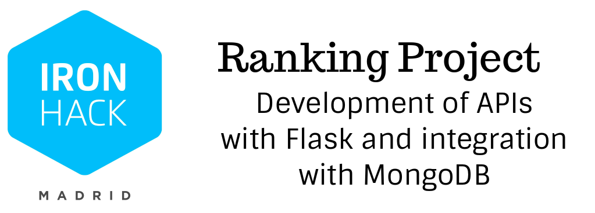

##### Project made in Ironhack 08.20 bootcamp
## Objective
There are two main goals for this project. The main objective  is the practice in the development of web APIs with ```Flask``` library for Python. The second objective consists of integrating the required data in ```MongoDB``` database.

## Using the program and available commands

Run some of these commands in Terminal as follows. Two types of report are available:
##### - Report by user-defined period of time: Run commands ```-t``` and ```-f```
##### - Report by user-defined model: Run command ```-l```


- ``python3 main.py -h``, ``--help``  show this help message and exit

- ``python3 main.py -m MAIL``,``--mail MAIL``=>  Introduce your mail

- ``python3 main.py  -f DATEFROM``, ``--dateFrom`` DATEFROM => Introduce the starting date for the analysis in format YYYY-MM-DD. Please, note that data is only available from 2010 so the input date must be equal or later

- ``python3 main.py  -t DATETO``, `--dateTo DATETO` => Introduce the ending date for the analysis in format YYYY-MM-DD. Please, note that data is only available until september 2020 so the input date must be equal
  or later
  
- `python3 main.py  -l MODEL`, ``--model MODEL`` => Introduce Iphone model. Available from iPhone 4 (2010) to iPhone SE (2020). Input must be equal to: iphone 4 iPhone 4s iPhone 5 iPhone 5s iPhone 5c iPhone 6 iPhone 6 Plus iPhone 6s iPhone 6s Plus iPhone SE (1ª generación) iPhone 7 iPhone 7 Plus iPhone 8 iPhone 8 Plus iPhone X iPhone XS iPhone XS Max iPhone XR iPhone11 iPhone 11 Pro iPhone 11 Pro Max iPhone SE (2ª generación)


## Project Structure

- `main.py`: Executable script to download data from GitHub and import into MongoDB. See more info in Program Use.
- `server.py`: Executable script to start Flask server.
-  `__Trash__/`: Jupyter file used for developement testing 
- `src/`:
	1. `get_github.py`: Script used in `main.py` to download data from GitHub
	2. `get_mongo`: Script used in `main.py` to import data into MongoDB
	3. `students.json`: Json file with the data downloaded from GitHub
	4. `server/`: folder containing configuration files for the server and MongoDB
	5. `controllers/`: 
		- `gen_api.py`: Script that executes the endpoints in the API
	 

## Using the program

#### Starting the Flask server for the API
 Execute `python3 server.py` from the terminal. You show obtain a message like this:
```bash
 * Serving Flask app "ranking" (lazy loading)
 * Environment: production
   WARNING: This is a development server. Do not use it in a production deployment.
   Use a production WSGI server instead.
 * Debug mode: on
 * Running on http://0.0.0.0:3000/ (Press CTRL+C to quit)
 * Restarting with stat
 * Debugger is active!
 * Debugger PIN: 291-879-593
```
#### Downloading data from GitHub and importing it into MongoDB
 Execute `python3 main.py <-OPTION>` from the terminal including one of the options below:

```bash
main.py -h
usage: main.py [-h] [-s] [-l] [-p] [-hu]

Indicate what you want to import into MongoDB database: users, labs or pulls

optional arguments:
  -h, --help      show this help message and exit
  -s, --students  Imports all users from Json file into MongoDB
  -l, --labs      Imports all labs from Json file into MongoDB
  -p, --pulls     Imports all pulls from Json file into MongoDB
  -hu, --hub      Imports info from github to Json file
```
#### Using the API endpoints

Introduce the url in your internet navigator:[local](http://localhost:3000/)

"A.--> /student/create/<studentname>.": "Creates a student and save into DB",
        "B.--> /student/all": "Lists all students in database",
        "C.--> /lab/create/<labname>": "Creates a lab to be analyzed",
        "D.--> /lab/<lab_id>/search": "Search student submissions on specific lab",
        "E.--> /lab/<lab_id>/meme": "Get a random meme (extracted from the ones used for each student pull request for that lab"


## Main sources and references

###### Data source
 - Student names, labs and pull requests in ironhack/datamad0820 repo in GitHub: [link to repo](https://github.com/ironhack-datalabs/datamad0820)
###### Python libraries and programs
- `flask`
- `pymongo`
- `argsparse`
- `MongoDB`
